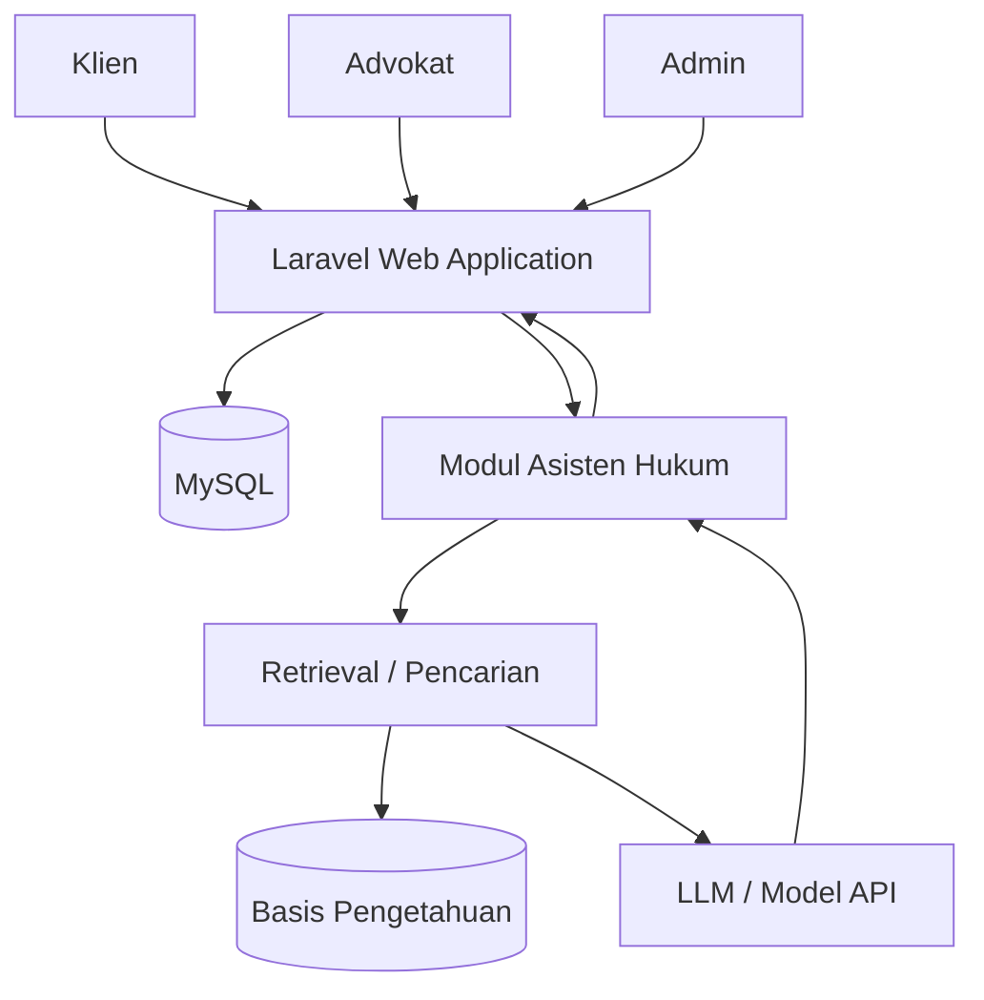

# PRD — Sahabat Hukum

## 1. Overview

**Sahabat Hukum** adalah sistem informasi manajemen perkara dan layanan konsultasi hukum berbasis web yang digunakan oleh **Klien, Advokat, dan Admin**. Sistem dirancang untuk membantu kantor hukum mengelola proses layanan hukum secara lebih terstruktur, mulai dari pengajuan konsultasi, penjadwalan, pengelolaan perkara, dokumen, komunikasi, hingga pemantauan perkembangan perkara.

Sistem juga menyediakan **Asisten Hukum** berbasis **Retrieval-Augmented Generation (RAG)** sebagai sarana pemberian informasi awal. Asisten Hukum menggunakan **Basis Pengetahuan** yang dikelola dan diverifikasi oleh Admin, sehingga jawaban tidak dimaksudkan untuk menggantikan konsultasi atau keputusan Advokat.

### Masalah utama yang diselesaikan

- Data Klien, konsultasi, perkara, dokumen, dan jadwal berpotensi masih tersebar atau dikelola secara manual.
- Klien kesulitan mengetahui status dan perkembangan perkara secara terstruktur.
- Advokat membutuhkan pengelolaan jadwal, dokumen, data Klien, dan perkembangan perkara yang lebih terpusat.
- Informasi umum mengenai layanan dan persyaratan hukum sering harus disampaikan berulang kepada Klien.
- Belum terdapat sarana informasi awal berbasis Basis Pengetahuan yang dapat membantu Klien sebelum berkonsultasi langsung dengan Advokat.

### Tujuan utama

- Menyediakan sistem informasi terintegrasi untuk Klien, Advokat, dan Admin.
- Memudahkan pengelolaan konsultasi, perkara, dokumen, jadwal, percakapan, dan pemberitahuan.
- Membantu Klien memantau proses dan perkembangan perkara.
- Membantu Advokat mengelola kegiatan pelayanan hukum secara terpusat.
- Menyediakan Asisten Hukum berbasis RAG untuk memberikan informasi awal berdasarkan Basis Pengetahuan yang dikelola Admin.

---

## 2. Roles & Access

### Klien

Klien dapat:
- Registrasi dan masuk ke sistem.
- Mengelola profil.
- Mengajukan konsultasi.
- Melihat jadwal konsultasi dan kegiatan terkait perkara.
- Berkomunikasi dengan Advokat melalui percakapan di sistem.
- Mengunggah dokumen yang diminta Advokat.
- Melihat perkara yang sedang ditangani.
- Memantau status dan perkembangan perkara.
- Melihat pemberitahuan.
- Menggunakan Asisten Hukum untuk memperoleh informasi awal.

### Advokat

Advokat dapat:
- Masuk dan mengelola profil.
- Memeriksa dan mengelola pengajuan konsultasi.
- Menjadwalkan konsultasi.
- Menambah, mengubah, atau membatalkan jadwal pribadi pada kalender.
- Mencatat hasil konsultasi.
- Membuat perkara berdasarkan hasil konsultasi.
- Menambahkan perkembangan perkara.
- Mengelola data Klien yang ditangani.
- Membuat permintaan dokumen.
- Memeriksa dan memverifikasi dokumen Klien.
- Berkomunikasi dengan Klien.
- Melihat pemberitahuan dan agenda.

### Admin

Admin dapat:
- Masuk ke sistem.
- Mengelola akun Klien dan Advokat.
- Mengelola data master Klien, Advokat, Konsultasi, Perkara, dan Dokumen.
- Mengelola Basis Pengetahuan Asisten Hukum.
- Melihat laporan/rekapitulasi sistem.
- Mengelola pengaturan umum sistem.

---

## 3. Core Features

### A. Autentikasi & Profil
- Registrasi Klien.
- Login Klien, Advokat, dan Admin.
- Logout.
- Pengelolaan profil pengguna.
- Pengaturan status akun oleh Admin.

### B. Konsultasi
- Klien mengajukan konsultasi.
- Klien mengisi jenis permasalahan, judul, uraian masalah, dan kebutuhan konsultasi.
- Advokat melihat pengajuan.
- Advokat menerima atau menindaklanjuti pengajuan.
- Advokat menjadwalkan konsultasi.
- Sistem mencatat hasil konsultasi.
- Status konsultasi, misalnya:
  - Menunggu
  - Dijadwalkan
  - Selesai
  - Dibatalkan

Pelaksanaan konsultasi dapat dilakukan di kantor atau melalui media eksternal seperti WhatsApp, Zoom, atau Google Meet. Sistem tidak menyediakan video conference internal.

### C. Manajemen Perkara
Perkara dibuat oleh Advokat berdasarkan hasil konsultasi dan digunakan sebagai pusat pemantauan proses kasus.

Data perkara dapat mencakup:
- Nomor perkara.
- Nama Klien.
- Jenis perkara.
- Advokat penanggung jawab.
- Ringkasan perkara.
- Status perkara.
- Tanggal mulai.
- Riwayat perkembangan.
- Riwayat konsultasi.
- Dokumen perkara.
- Catatan Advokat.

Jenis perkara dapat mencakup perkara **Perdata** dan **Pidana**. Struktur dokumen dan tahapan dapat disesuaikan dengan kebutuhan perkara yang ditangani.

### D. Dokumen
Advokat dapat membuat permintaan dokumen kepada Klien:
- Nama dokumen.
- Keterangan.
- Batas waktu.
- Tingkat kepentingan.

Klien dapat mengunggah dokumen sesuai permintaan.

Status dokumen:
- Belum Diunggah
- Menunggu Pemeriksaan
- Sudah Diterima
- Perlu Diperbaiki

Advokat dapat memeriksa dan memperbarui status dokumen.

### E. Jadwal & Kalender
- Klien melihat jadwal konsultasi dan kegiatan yang berkaitan dengan layanan hukum.
- Advokat memiliki kalender pribadi untuk mengelola agenda.
- Advokat dapat menambahkan jadwal secara manual.
- Advokat dapat mengubah jadwal.
- Advokat dapat membatalkan jadwal.
- Sistem menampilkan pengingat dan pemberitahuan terkait jadwal.

Sistem hanya berfungsi sebagai pengelola dan pengingat jadwal. Link Zoom/Google Meet atau komunikasi melalui WhatsApp dapat digunakan di luar sistem dan tidak menjadi fitur video conference internal.

### F. Percakapan
- Percakapan antara Klien dan Advokat.
- Riwayat pesan.
- Pengiriman pesan.
- Pengunggahan dokumen melalui percakapan jika diperlukan.

Komunikasi melalui WhatsApp di luar sistem tidak dikelola oleh aplikasi.

### G. Pemberitahuan
Pemberitahuan digunakan untuk:
- Jadwal konsultasi.
- Perubahan status konsultasi.
- Permintaan dokumen.
- Status pemeriksaan dokumen.
- Perkembangan perkara.
- Perubahan atau pembatalan jadwal.

### H. Asisten Hukum
Asisten Hukum adalah fitur informasi awal bagi Klien.

Alur dasarnya:
1. Klien mengajukan pertanyaan.
2. Sistem mencari informasi yang relevan pada Basis Pengetahuan.
3. Informasi relevan digunakan sebagai konteks.
4. Model bahasa menghasilkan jawaban berdasarkan konteks tersebut.
5. Sistem menampilkan jawaban beserta disclaimer.

Asisten Hukum tidak:
- Menentukan hasil perkara.
- Memberikan keputusan hukum.
- Menggantikan Advokat.
- Memberikan rekomendasi hukum final.

Pertanyaan yang membutuhkan analisis lebih lanjut diarahkan kepada Advokat.

### I. Basis Pengetahuan
Admin dapat:
- Menambah sumber informasi.
- Mengunggah dokumen.
- Mengubah informasi.
- Menghapus sumber.
- Memperbarui informasi.
- Melihat status sumber.

Sumber dapat berupa:
- Panduan layanan konsultasi.
- Persyaratan dokumen.
- Informasi layanan kantor.
- Prosedur layanan.
- Referensi peraturan/perundang-undangan.
- Informasi hukum umum yang telah diverifikasi.

---

## 4. User Flow

### Flow Klien

1. Klien membuka sistem.
2. Klien registrasi atau login.
3. Klien melihat Beranda.
4. Klien dapat mengajukan konsultasi.
5. Sistem menyimpan pengajuan.
6. Advokat memeriksa pengajuan.
7. Advokat menjadwalkan konsultasi.
8. Klien menerima pemberitahuan dan melihat jadwal.
9. Konsultasi dilaksanakan secara langsung atau melalui media eksternal.
10. Advokat mencatat hasil konsultasi.
11. Jika diperlukan, Advokat membuat perkara.
12. Advokat dapat meminta dokumen.
13. Klien mengunggah dokumen.
14. Advokat memeriksa dokumen.
15. Advokat menambahkan perkembangan perkara.
16. Klien memantau perkembangan melalui menu Perkara Saya.
17. Klien dapat menggunakan Percakapan untuk komunikasi dengan Advokat.
18. Klien dapat menggunakan Asisten Hukum untuk memperoleh informasi awal.

### Flow Advokat

1. Advokat login.
2. Advokat melihat Beranda dan agenda.
3. Advokat memeriksa pengajuan konsultasi.
4. Advokat menerima/menindaklanjuti pengajuan.
5. Advokat menjadwalkan konsultasi.
6. Advokat dapat menambah atau mengubah jadwal pribadi melalui kalender.
7. Konsultasi dilaksanakan.
8. Advokat mencatat hasil konsultasi.
9. Jika diperlukan, Advokat membuat perkara.
10. Advokat mengelola perkembangan perkara.
11. Advokat mengelola data Klien.
12. Advokat meminta dokumen kepada Klien.
13. Advokat memeriksa dokumen yang diunggah.
14. Advokat berkomunikasi dengan Klien.
15. Advokat menerima pemberitahuan terkait agenda dan aktivitas perkara.

### Flow Admin

1. Admin login.
2. Admin melihat Beranda.
3. Admin mengelola data Klien dan Advokat.
4. Admin memantau data konsultasi, perkara, dan dokumen.
5. Admin mengelola Basis Pengetahuan Asisten Hukum.
6. Admin memperbarui atau menghapus sumber informasi.
7. Admin melihat laporan/rekapitulasi.
8. Admin mengelola pengaturan sistem.

---

## 5. Architecture

Sistem menggunakan arsitektur **full-stack web application** dengan Laravel sebagai framework utama.

### Teknologi utama

- **Laravel (PHP)** — backend, routing, autentikasi, logika bisnis, dan Blade sebagai antarmuka.
- **MySQL** — basis data relasional.
- **RAG** — metode/arsitektur untuk mengambil informasi relevan dari Basis Pengetahuan sebelum jawaban dibuat.
- **Large Language Model (LLM)/Model API** — menghasilkan jawaban Asisten Hukum berdasarkan konteks hasil retrieval.
- **Visual Studio Code** — pengembangan kode.
- **XAMPP** — lingkungan server lokal.
- **Composer** — manajemen dependensi PHP.
- **GitHub** — version control.
- **Postman** — pengujian API.
- **Figma** — desain UI/UX.
- **Draw.io** — perancangan diagram.

### Arsitektur sederhana

Laravel menjadi pusat sistem. Data operasional disimpan pada MySQL. Pada fitur Asisten Hukum, sistem mengambil informasi relevan dari Basis Pengetahuan melalui proses retrieval, kemudian konteks tersebut digunakan oleh LLM untuk menghasilkan jawaban.

---

## 6. Database Schema

Struktur berikut merupakan rancangan high-level dan dapat disesuaikan saat implementasi.

### `users`
Menyimpan akun pengguna.
- `id`
- `name`
- `email`
- `password`
- `role` — client, lawyer, admin
- `status`
- `created_at`
- `updated_at`

### `client_profiles`
Menyimpan data profil Klien.
- `id`
- `user_id`
- `phone`
- `address`
- `created_at`
- `updated_at`

### `lawyer_profiles`
Menyimpan data Advokat.
- `id`
- `user_id`
- `specialization`
- `phone`
- `created_at`
- `updated_at`

### `consultations`
Menyimpan pengajuan dan riwayat konsultasi.
- `id`
- `client_id`
- `lawyer_id`
- `problem_type`
- `title`
- `description`
- `scheduled_at`
- `status`
- `result_notes`
- `created_at`
- `updated_at`

### `cases`
Menyimpan data perkara.
- `id`
- `client_id`
- `lawyer_id`
- `consultation_id`
- `case_number`
- `case_type`
- `title`
- `summary`
- `status`
- `started_at`
- `created_at`
- `updated_at`

### `case_progress`
Menyimpan perkembangan perkara.
- `id`
- `case_id`
- `title`
- `description`
- `progress_date`
- `created_by`
- `created_at`

### `documents`
Menyimpan dokumen perkara/konsultasi.
- `id`
- `case_id`
- `client_id`
- `lawyer_id`
- `name`
- `description`
- `file_path`
- `due_date`
- `priority`
- `status`
- `created_at`
- `updated_at`

### `schedules`
Menyimpan agenda dan jadwal.
- `id`
- `lawyer_id`
- `client_id` nullable
- `consultation_id` nullable
- `case_id` nullable
- `title`
- `description`
- `start_at`
- `end_at`
- `location`
- `status`
- `created_at`
- `updated_at`

### `conversations`
Menyimpan percakapan.
- `id`
- `client_id`
- `lawyer_id`
- `case_id` nullable
- `created_at`
- `updated_at`

### `messages`
Menyimpan pesan.
- `id`
- `conversation_id`
- `sender_id`
- `message`
- `attachment_path` nullable
- `created_at`

### `notifications`
Menyimpan pemberitahuan pengguna.
- `id`
- `user_id`
- `title`
- `message`
- `type`
- `read_at` nullable
- `created_at`

### `knowledge_sources`
Menyimpan sumber Basis Pengetahuan yang dikelola Admin.
- `id`
- `title`
- `description`
- `source_type`
- `file_path` nullable
- `content`
- `status`
- `verified_by`
- `created_at`
- `updated_at`

### `knowledge_chunks`
Menyimpan potongan informasi yang digunakan pada proses retrieval.
- `id`
- `knowledge_source_id`
- `content`
- `embedding` / representasi vektor sesuai teknologi penyimpanan yang digunakan
- `created_at`

### `chat_sessions`
Menyimpan sesi Asisten Hukum.
- `id`
- `client_id`
- `created_at`

### `chat_messages`
Menyimpan pertanyaan dan jawaban Asisten Hukum.
- `id`
- `session_id`
- `role`
- `message`
- `created_at`

---

## 7. RAG & Asisten Hukum

### Konsep

RAG bukan nama algoritma klasifikasi, tetapi pendekatan yang menggabungkan **retrieval** dan **generation**. Sistem terlebih dahulu mencari informasi yang relevan dari Basis Pengetahuan, kemudian memberikan informasi tersebut sebagai konteks kepada LLM untuk menghasilkan jawaban.

### Alur pengelolaan Basis Pengetahuan

1. Admin menambahkan atau mengunggah sumber informasi.
2. Sistem menyimpan sumber.
3. Isi dokumen diproses menjadi bagian-bagian kecil (*chunk*).
4. Setiap chunk dibuat menjadi representasi embedding jika diperlukan.
5. Representasi tersebut disimpan untuk pencarian.
6. Sumber dapat diperbarui atau dihapus oleh Admin.

### Alur ketika Klien bertanya

1. Klien mengirim pertanyaan.
2. Sistem menerima pertanyaan.
3. Sistem melakukan retrieval terhadap Basis Pengetahuan.
4. Sistem mengambil beberapa informasi yang paling relevan.
5. Informasi tersebut menjadi konteks untuk LLM.
6. LLM menghasilkan jawaban berdasarkan konteks.
7. Sistem menampilkan jawaban kepada Klien.
8. Sistem menampilkan disclaimer bahwa informasi bersifat umum dan bukan pengganti konsultasi Advokat.

### Catatan implementasi

Pemilihan layanan LLM, model embedding, dan penyimpanan vector dapat ditentukan pada tahap implementasi sesuai kebutuhan, biaya, ketersediaan API, dan kemampuan lingkungan pengembangan. **Python tidak wajib digunakan** apabila proses RAG dapat diimplementasikan menggunakan ekosistem PHP/Laravel dan layanan API yang dipilih.

---

## 8. Functional Requirements

| Kode | Fitur | Kebutuhan Fungsional |
|---|---|---|
| KF-01 | Autentikasi Pengguna | Sistem menyediakan registrasi Klien serta login bagi Klien, Advokat, dan Admin sesuai peran. |
| KF-02 | Kelola Profil | Klien dan Advokat dapat melihat serta memperbarui profil. |
| KF-03 | Ajukan Konsultasi | Klien dapat mengajukan konsultasi beserta ringkasan permasalahan. |
| KF-04 | Kelola Konsultasi | Advokat dapat memeriksa, menerima, dan menjadwalkan konsultasi. |
| KF-05 | Catat Hasil Konsultasi | Advokat dapat mencatat ringkasan dan hasil konsultasi. |
| KF-06 | Kelola Perkara | Advokat dapat membuat dan mengelola perkara berdasarkan hasil konsultasi. |
| KF-07 | Perkembangan Perkara | Advokat dapat menambahkan perkembangan perkara secara berkala. |
| KF-08 | Pantau Perkara | Klien dapat melihat status dan riwayat perkembangan perkara miliknya. |
| KF-09 | Permintaan Dokumen | Advokat dapat meminta dokumen dengan keterangan, batas waktu, dan tingkat kepentingan. |
| KF-10 | Unggah Dokumen | Klien dapat mengunggah dokumen sesuai permintaan. |
| KF-11 | Verifikasi Dokumen | Advokat dapat memeriksa dan memperbarui status dokumen. |
| KF-12 | Kelola Jadwal | Advokat dapat menambah, mengubah, dan membatalkan jadwal; Klien dapat melihat jadwalnya. |
| KF-13 | Percakapan | Klien dan Advokat dapat bertukar pesan terkait konsultasi/perkara. |
| KF-14 | Pemberitahuan | Sistem menyediakan pemberitahuan mengenai jadwal, dokumen, konsultasi, dan perkembangan perkara. |
| KF-15 | Tanya Asisten Hukum | Klien dapat bertanya kepada Asisten Hukum dan menerima jawaban berbasis RAG. |
| KF-16 | Kelola Basis Pengetahuan | Admin dapat menambah, mengubah, menghapus, dan memperbarui sumber informasi. |
| KF-17 | Kelola Pengguna | Admin dapat mengelola akun Klien dan Advokat. |
| KF-18 | Kelola Data Master | Admin dapat mengelola data Klien, Advokat, Konsultasi, Perkara, dan Dokumen. |
| KF-19 | Laporan | Admin dapat melihat rekapitulasi konsultasi, perkara, dan penggunaan Asisten Hukum. |
| KF-20 | Pengaturan | Admin dapat mengelola pengaturan umum sistem. |

---

## 9. Non-Functional Requirements

- **Keamanan:** akses fitur dibatasi berdasarkan role pengguna.
- **Kerahasiaan:** data perkara dan dokumen hanya dapat diakses oleh pihak yang memiliki hak akses.
- **Usability:** antarmuka menggunakan Bahasa Indonesia dan dirancang sederhana serta mudah dipahami.
- **Responsiveness:** sistem dapat digunakan pada desktop dan perangkat dengan ukuran layar yang lebih kecil.
- **Maintainability:** struktur aplikasi Laravel menggunakan pemisahan komponen dan modul yang terorganisasi.
- **Performance:** halaman dan proses utama harus memberikan respons yang wajar pada lingkungan pengujian.
- **Reliability:** sistem harus mencegah kehilangan data ketika proses penyimpanan dilakukan.
- **Auditability:** aktivitas penting seperti perubahan status dokumen, perkara, dan sumber Basis Pengetahuan perlu dapat ditelusuri bila dibutuhkan.

---

## 10. UI/UX Requirements

Desain mengikuti konsep **kantor hukum profesional di Indonesia**, bukan gaya landing page startup atau desain AI generatif.

### Identitas visual

- Nama sistem: **Sahabat Hukum**
- Motto: **“Fiat justitia ruat caelum”**
- Dominan putih.
- Aksen navy/biru tua yang memberikan kesan profesional dan terpercaya.
- Abu-abu muda untuk background dan pembatas.
- Hijau untuk status berhasil.
- Merah hanya untuk peringatan atau tindakan penting.
- Tipografi modern dan mudah dibaca.
- Icon menggunakan gaya profesional, sederhana, dan konsisten.
- Hindari neon, gradient berlebihan, ilustrasi AI, dan dekorasi yang tidak memiliki fungsi.

### Navigasi Klien

- Beranda
- Konsultasi
- Perkara Saya
- Dokumen
- Jadwal
- Percakapan
- Asisten Hukum
- Pemberitahuan
- Profil
- Keluar

### Navigasi Advokat

- Beranda
- Konsultasi
- Perkara
- Data Klien
- Dokumen
- Jadwal
- Percakapan
- Pemberitahuan
- Profil
- Keluar

### Navigasi Admin

- Beranda
- Data Klien
- Data Advokat
- Data Perkara
- Data Konsultasi
- Dokumen
- Pengguna
- Basis Pengetahuan
- Laporan
- Pengaturan
- Keluar

---

## 11. Business Rules

1. Setiap pengguna hanya dapat mengakses fitur sesuai role.
2. Klien hanya dapat melihat perkara, dokumen, jadwal, dan percakapan yang berkaitan dengan dirinya.
3. Advokat hanya mengelola perkara dan Klien yang menjadi tanggung jawabnya.
4. Perkara dibuat oleh Advokat berdasarkan kebutuhan setelah proses konsultasi.
5. Dokumen yang diminta Advokat dapat diunggah oleh Klien dan harus diperiksa sebelum dinyatakan diterima.
6. Jadwal yang dibatalkan harus memiliki status pembatalan dan dapat memicu pemberitahuan.
7. Asisten Hukum hanya menggunakan sumber yang tersedia pada Basis Pengetahuan.
8. Admin bertanggung jawab mengelola dan memverifikasi sumber Basis Pengetahuan.
9. Asisten Hukum harus menampilkan batasan bahwa jawabannya merupakan informasi umum.
10. Sistem tidak mengelola komunikasi WhatsApp, Zoom, atau Google Meet secara internal.

---

## 12. Testing

### Functional Testing
Pengujian fungsional sistem menggunakan **Black-box Testing** untuk memastikan setiap fitur menghasilkan keluaran sesuai kebutuhan.

Fokus pengujian:
- Login dan registrasi.
- Hak akses role.
- Pengajuan konsultasi.
- Penjadwalan.
- Pengelolaan perkara.
- Pengelolaan dokumen.
- Kalender.
- Percakapan.
- Pemberitahuan.
- Pengelolaan Basis Pengetahuan.
- Asisten Hukum.

### Testing Asisten Hukum

Evaluasi Asisten Hukum dilakukan berdasarkan:
- Kesesuaian jawaban dengan Basis Pengetahuan.
- Relevansi jawaban terhadap pertanyaan.
- Kemampuan menggunakan konteks hasil retrieval.
- Penanganan pertanyaan di luar Basis Pengetahuan.
- Konsistensi disclaimer dan pengalihan kepada Advokat untuk permasalahan yang memerlukan analisis hukum.

---

## 13. Scope & Limitations

Sistem **tidak mencakup**:
- Video conference internal.
- Persidangan daring.
- Pembuatan dokumen hukum otomatis.
- Pembayaran layanan hukum.
- Integrasi langsung dengan sistem pengadilan.
- Integrasi langsung dengan lembaga hukum eksternal.
- Pengelolaan komunikasi WhatsApp/Zoom/Google Meet secara internal.

Data pengembangan dan pengujian menggunakan data yang disediakan pihak terkait atau data simulasi dan menghindari penggunaan informasi Klien yang bersifat sensitif.

---

## 14. Development Method

Metode pengembangan sistem menggunakan **Waterfall** dengan tahapan:

1. **Analisis Kebutuhan** — mengidentifikasi kebutuhan Klien, Advokat, Admin, dan kebutuhan Asisten Hukum.
2. **Perancangan Sistem** — membuat UI/UX, flowmap, Use Case Diagram, Activity Diagram, ERD, dan rancangan database.
3. **Implementasi** — membangun aplikasi menggunakan Laravel, PHP, MySQL, dan teknologi pendukung RAG/LLM.
4. **Pengujian** — melakukan Black-box Testing dan evaluasi Asisten Hukum.
5. **Pemeliharaan** — melakukan perbaikan berdasarkan hasil pengujian.

---

## 15. Future Enhancements

Fitur berikut dapat dipertimbangkan setelah MVP:
- Integrasi WhatsApp Business API.
- Integrasi kalender eksternal.
- Integrasi pembayaran online.
- Integrasi sistem pengadilan jika tersedia dan sesuai kebutuhan.
- Peningkatan evaluasi RAG.
- Pengelolaan versi sumber Basis Pengetahuan.
