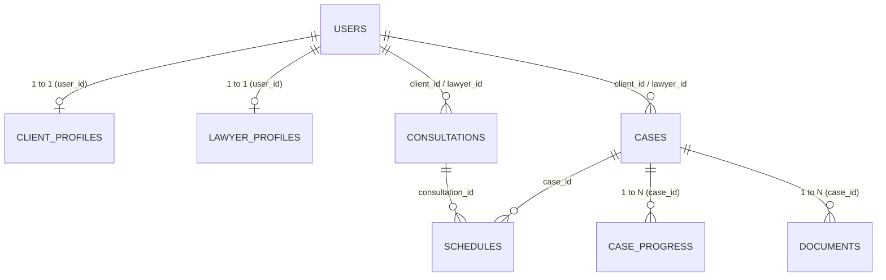

# Dokumentasi Sistem Sahabat Hukum
**Sistem Informasi Manajemen Perkara dan Layanan Konsultasi Hukum**  
*Framework: Laravel 10/11 | Basis Data: MySQL*

---

## 1. Pendahuluan

Aplikasi **Sahabat Hukum** adalah platform berbasis web yang mengintegrasikan layanan konsultasi hukum, manajemen perkara, dan pengelolaan dokumen bukti secara digital. Sistem ini dirancang untuk tiga jenis entitas pengguna:
1. **Klien**: Masyarakat umum yang mencari konsultasi atau pendampingan hukum.
2. **Advokat**: Praktisi hukum profesional yang memberikan konsultasi dan menangani perkara peradilan/non-peradilan.
3. **Admin**: Pengelola sistem yang mengontrol data master pengguna, advokat, verifikasi kasus, dan laporan.

---

## 2. Struktur Arsitektur & Direktori (MVC)

Aplikasi dibangun dengan pola arsitektur **Model-View-Controller (MVC)**:

```text
SahabatHukum/
├── app/
│   ├── Http/
│   │   ├── Controllers/
│   │   │   ├── AuthController.php          # Login, Register Klien, Logout
│   │   │   ├── ClientController.php        # Fitur & Dashboard Klien
│   │   │   ├── AdvokatController.php       # Fitur & Dashboard Advokat
│   │   │   └── AdminController.php         # Fitur & Dashboard Admin
│   │   └── Middleware/
│   │       ├── RoleMiddleware.php          # Proteksi rute berbasis role
│   │       └── RedirectIfAuthenticated.php # Pengalihan pengguna yang sudah login
│   └── Models/
│       ├── User.php                        # Model master pengguna
│       ├── ClientProfile.php               # Data profil Klien
│       ├── LawyerProfile.php               # Data profil Advokat
│       ├── Consultation.php                # Data pengajuan konsultasi
│       ├── LegalCase.php                   # Data perkara hukum
│       ├── CaseProgress.php                # Riwayat/progres perkara
│       ├── Document.php                    # Dokumen bukti dan lampiran
│       └── Schedule.php                    # Jadwal sidang / temu
├── database/
│   └── migrations/                         # Skema pembentukan tabel MySQL
├── resources/
│   └── views/
│       ├── auth/                           # login.blade.php & register.blade.php
│       ├── klien/                          # Halaman portal Klien
│       ├── advokat/                        # Halaman portal Advokat
│       ├── admin/                          # Halaman portal Admin
│       └── layouts/                        # Master layout bersama
└── routes/
    └── web.php                             # Definisi seluruh rute dan middleware
```

### Tabel Rincian File & Tanggung Jawab

| Komponen | Path File | Penjelasan & Tanggung Jawab |
| :--- | :--- | :--- |
| **Routing** | [routes/web.php](file:///c:/laragon/www/SahabatHukum/routes/web.php) | Memetakan URL web, mengikat controller, serta membentengi rute menggunakan middleware `guest`, `auth`, dan `role`. |
| **Controller** | [AuthController.php](file:///c:/laragon/www/SahabatHukum/app/Http/Controllers/AuthController.php) | Menangani autentikasi: form login, pemrosesan kredensial login, pendaftaran akun klien, serta logout. |
| **Controller** | [ClientController.php](file:///c:/laragon/www/SahabatHukum/app/Http/Controllers/ClientController.php) | Mengatur aksi klien: statistik perkara aktif, daftar pengajuan konsultasi, detail perkara, dan upload dokumen. |
| **Controller** | [AdvokatController.php](file:///c:/laragon/www/SahabatHukum/app/Http/Controllers/AdvokatController.php) | Mengatur aksi advokat: menyetujui/menjadwalkan konsultasi, memperbarui progres perkara, meminta dokumen, dan verifikasi keabsahan dokumen. |
| **Controller** | [AdminController.php](file:///c:/laragon/www/SahabatHukum/app/Http/Controllers/AdminController.php) | Mengatur fungsi administratif: audit data perkara, data klien/advokat, manajemen pengguna, dan laporan performa. |
| **Middleware** | [RoleMiddleware.php](file:///c:/laragon/www/SahabatHukum/app/Http/Middleware/RoleMiddleware.php) | Memvalidasi apakah user yang login memiliki role yang diizinkan (misal: hanya advokat yang boleh ke `/advokat/*`). |
| **Middleware** | [RedirectIfAuthenticated.php](file:///c:/laragon/www/SahabatHukum/app/Http/Middleware/RedirectIfAuthenticated.php) | Mencegah pengguna yang sudah login untuk membuka kembali halaman `/login` atau `/register` dan mengarahkan langsung ke dashboard perannya. |

---

## 3. Struktur Navigasi & Hak Akses Rute

Hak akses navigasi diatur secara terpusat di file [routes/web.php](file:///c:/laragon/www/SahabatHukum/routes/web.php):

### A. Rute Tamu & Autentikasi (`middleware: guest`)

| Endpoint | Method | Controller & Method | Deskripsi Alur |
| :--- | :---: | :--- | :--- |
| `/` | `GET` | *Closure* | Mengarahkan otomatis pengguna ke `/login`. |
| `/login` | `GET` | `AuthController@showLoginForm` | Menampilkan halaman login dengan opsi masuk manual atau tombol demo. |
| `/login` | `POST` | `AuthController@login` | Memvalidasi email dan password. Jika valid dan akun aktif, dialihkan ke dashboard sesuai peran (`admin`, `advokat`, atau `klien`). |
| `/register` | `GET` | `AuthController@showRegisterForm` | Menampilkan formulir pendaftaran khusus akun Klien. |
| `/register` | `POST` | `AuthController@register` | Menyimpan user baru ke tabel `users` & `client_profiles`, lalu dialihkan ke `/login` dengan notifikasi sukses. |
| `/logout` | `POST` | `AuthController@logout` | Mengakhiri session login (`middleware: auth`) dan mengembalikan pengguna ke halaman `/login`. |

---

### B. Portal Klien (`prefix: /klien` | `middleware: auth, role:klien`)

| Endpoint | Method | Controller & Method | Deskripsi Alur |
| :--- | :---: | :--- | :--- |
| `/klien` | `GET` | `ClientController@dashboard` | Menampilkan statistik jumlah perkara aktif, jadwal konsultasi terdekat, dan notifikasi dokumen tertunda. |
| `/klien/konsultasi` | `GET` | `ClientController@consultations` | Menampilkan daftar riwayat pengajuan konsultasi hukum klien. |
| `/klien/konsultasi` | `POST` | `ClientController@storeConsultation` | Mengirimkan formulir pengajuan konsultasi baru kepada advokat. |
| `/klien/konsultasi/{id}` | `GET` | `ClientController@consultationDetail` | Menampilkan status dan jadwal pertemuan konsultasi yang telah ditetapkan. |
| `/klien/perkara` | `GET` | `ClientController@cases` | Menampilkan daftar seluruh perkara hukum yang sedang didampingi. |
| `/klien/perkara/{id}` | `GET` | `ClientController@caseDetail` | Menampilkan detail perkara, riwayat kronologi (*progress* sidang), dan daftar dokumen bukti. |
| `/klien/dokumen/{id}/upload` | `POST` | `ClientController@uploadDocument` | Mengunggah file berkas digital bukti/identitas yang diminta advokat. |

---

### C. Portal Advokat (`prefix: /advokat` | `middleware: auth, role:advokat`)

| Endpoint | Method | Controller & Method | Deskripsi Alur |
| :--- | :---: | :--- | :--- |
| `/advokat` | `GET` | `AdvokatController@dashboard` | Tinjauan ringkasan perkara yang ditangani dan jadwal konsultasi mendatang. |
| `/advokat/konsultasi` | `GET` | `AdvokatController@consultations` | Menampilkan permohonan konsultasi dari klien. |
| `/advokat/konsultasi/{id}` | `GET` | `AdvokatController@consultationDetail` | Menampilkan detail permasalahan hukum yang diajukan klien. |
| `/advokat/konsultasi/{id}/jadwalkan` | `POST` | `AdvokatController@scheduleConsultation` | Menentukan tanggal dan jam temu sesi konsultasi. |
| `/advokat/konsultasi/{id}/selesai` | `POST` | `AdvokatController@completeConsultation` | Mengubah status konsultasi menjadi selesai dan memberikan catatan hukum. |
| `/advokat/perkara` | `GET` | `AdvokatController@cases` | Daftar seluruh perkara aktif yang menjadi tanggung jawab advokat. |
| `/advokat/perkara` | `POST` | `AdvokatController@storeCase` | Mendaftarkan perkara hukum baru ke dalam sistem. |
| `/advokat/perkara/{id}` | `GET` | `AdvokatController@caseDetail` | Detail lengkap perkara, klien terkait, dan tahapan persidangan. |
| `/advokat/perkara/{id}/perkembangan`| `POST` | `AdvokatController@addProgress` | Menambahkan tahapan perkembangan perkara (misal: mediasi, eksepsi, putusan). |
| `/advokat/perkara/{id}/dokumen` | `POST` | `AdvokatController@requestDocument` | Mengirimkan permintaan dokumen bukti tertentu kepada klien. |
| `/advokat/dokumen/{id}/verifikasi` | `POST` | `AdvokatController@verifyDocument` | Memvalidasi berkas yang diunggah klien (Terverifikasi atau Ditolak). |
| `/advokat/klien` | `GET` | `AdvokatController@clients` | Direktori daftar klien yang sedang atau pernah ditangani. |
| `/advokat/klien/{id}` | `GET` | `AdvokatController@clientDetail` | Profil dan rekam jejak perkara klien tertentu. |

---

### D. Portal Admin (`prefix: /admin` | `middleware: auth, role:admin`)

| Endpoint | Method | Controller & Method | Deskripsi Alur |
| :--- | :---: | :--- | :--- |
| `/admin` | `GET` | `AdminController@dashboard` | Pemantauan metrik menyeluruh (total user, perkara, konsultasi, berkas). |
| `/admin/clients` | `GET` | `AdminController@clients` | Manajemen seluruh akun Klien di sistem. |
| `/admin/lawyers` | `GET` | `AdminController@lawyers` | Manajemen akun dan profil Advokat (pendaftaran akun advokat dilakukan oleh Admin). |
| `/admin/cases` | `GET` | `AdminController@cases` | Audit seluruh daftar perkara yang tercatat di sistem. |
| `/admin/consultations` | `GET` | `AdminController@consultations` | Pemantauan semua konsultasi yang berjalan di sistem. |
| `/admin/documents` | `GET` | `AdminController@documents` | Pengawasan berkas digital yang tersimpan. |
| `/admin/reports` | `GET` | `AdminController@reports` | Rekapitulasi laporan operasional berkala. |

---

## 4. Desain & Integrasi Database

Database MySQL dirancang secara relasional dan dikelola menggunakan **Migration** serta **Eloquent Model**:

### Diagram Relasi Entitas (ERD)



### Tabel & Model Eloquent

#### 1. Tabel `users` ([app/Models/User.php](file:///c:/laragon/www/SahabatHukum/app/Models/User.php))
- **File Migrasi**: `0001_01_01_000000_create_users_table.php`
- **Fungsi**: Entitas utama akun login sistem.
- **Kolom Utama**: `id`, `name`, `email`, `password`, `role` (`'admin'`, `'advokat'`, `'klien'`), `status` (`'aktif'`, `'nonaktif'`).
- **Relasi**:
  - `hasOne(ClientProfile::class)`
  - `hasOne(LawyerProfile::class)`
  - `hasMany(Consultation::class, 'client_id')`
  - `hasMany(LegalCase::class, 'client_id')`

#### 2. Tabel `client_profiles` ([app/Models/ClientProfile.php](file:///c:/laragon/www/SahabatHukum/app/Models/ClientProfile.php))
- **File Migrasi**: `2026_01_01_000001_create_client_profiles_table.php`
- **Fungsi**: Menyimpan informasi pelengkap klien. Dibuat otomatis saat Klien mendaftar di `AuthController::register`.
- **Kolom Utama**: `id`, `user_id` (FK ke `users.id`), `phone`, `nik`, `address`, `occupation`.
- **Relasi**: `belongsTo(User::class)`.

#### 3. Tabel `lawyer_profiles` ([app/Models/LawyerProfile.php](file:///c:/laragon/www/SahabatHukum/app/Models/LawyerProfile.php))
- **File Migrasi**: `2026_01_01_000002_create_lawyer_profiles_table.php`
- **Fungsi**: Profil kredensial advokat.
- **Kolom Utama**: `id`, `user_id` (FK ke `users.id`), `phone`, `specialization`, `license_number`, `bio`.
- **Relasi**: `belongsTo(User::class)`.

#### 4. Tabel `consultations` ([app/Models/Consultation.php](file:///c:/laragon/www/SahabatHukum/app/Models/Consultation.php))
- **File Migrasi**: `2026_01_01_000003_create_consultations_table.php`
- **Fungsi**: Manajemen konsultasi hukum antara klien dan advokat.
- **Kolom Utama**: `id`, `client_id` (FK ke `users.id`), `lawyer_id` (FK ke `users.id`), `topic`, `description`, `status` (`'Menunggu'`, `'Dijadwalkan'`, `'Selesai'`, `'Ditolak'`), `scheduled_at`.
- **Relasi**:
  - `belongsTo(User::class, 'client_id')`
  - `belongsTo(User::class, 'lawyer_id')`

#### 5. Tabel `cases` ([app/Models/LegalCase.php](file:///c:/laragon/www/SahabatHukum/app/Models/LegalCase.php))
- **File Migrasi**: `2026_01_01_000004_create_cases_table.php`
- **Fungsi**: Menampung perkara hukum yang sedang diproses.
- **Kolom Utama**: `id`, `case_number`, `client_id` (FK), `lawyer_id` (FK), `category` (Perdata, Pidana, dll.), `title`, `description`, `status` (`'Baru'`, `'Proses'`, `'Sidang'`, `'Selesai'`, `'Dibatalkan'`), `court_name`.
- **Relasi**:
  - `hasMany(CaseProgress::class, 'case_id')`
  - `hasMany(Document::class, 'case_id')`

#### 6. Tabel `case_progress` ([app/Models/CaseProgress.php](file:///c:/laragon/www/SahabatHukum/app/Models/CaseProgress.php))
- **File Migrasi**: `2026_01_01_000007_create_case_progress_table.php`
- **Fungsi**: Riwayat tahapan perkara hukum secara kronologis (pendaftaran, sidang mediasi, replik/duplik, pembuktian, putusan).
- **Kolom Utama**: `id`, `case_id` (FK ke `cases.id`), `title`, `description`, `date`, `status`.
- **Relasi**: `belongsTo(LegalCase::class, 'case_id')`.

#### 7. Tabel `documents` ([app/Models/Document.php](file:///c:/laragon/www/SahabatHukum/app/Models/Document.php))
- **File Migrasi**: `2026_01_01_000005_create_documents_table.php`
- **Fungsi**: Berkas digital dokumen bukti, surat kuasa, dan dokumen identitas.
- **Kolom Utama**: `id`, `case_id` (FK), `client_id` (FK), `file_name`, `file_path`, `file_size`, `status` (`'Belum Diunggah'`, `'Menunggu Verifikasi'`, `'Terverifikasi'`, `'Ditolak'`), `requested_by`.
- **Relasi**:
  - `belongsTo(LegalCase::class, 'case_id')`
  - `belongsTo(User::class, 'client_id')`

#### 8. Tabel `schedules` ([app/Models/Schedule.php](file:///c:/laragon/www/SahabatHukum/app/Models/Schedule.php))
- **File Migrasi**: `2026_01_01_000008_create_schedules_table.php`
- **Fungsi**: Kalender agenda sidang pengadilan atau jadwal tatap muka konsultasi.
- **Kolom Utama**: `id`, `consultation_id` (FK), `case_id` (FK), `title`, `date_time`, `location`, `type`, `notes`.
- **Relasi**:
  - `belongsTo(Consultation::class, 'consultation_id')`
  - `belongsTo(LegalCase::class, 'case_id')`

---

## 5. Ringkasan Pembaruan Terkini

Berdasarkan permintaan perbaikan sistem sebelumnya:
1. **Alur Registrasi Klien**:
   - Fungsi login otomatis (`Auth::login($user)`) setelah pendaftaran telah **dihapus**.
   - Klien yang baru mendaftar dialihkan ke halaman `route('login')`.
2. **Flash Message Sukses**:
   - Halaman `/login` kini menampilkan pemberitahuan hijau (*alert-success*) yang mengonfirmasi bahwa pendaftaran akun berhasil.
3. **Pre-fill Email Otomatis**:
   - Kolom email login otomatis terisi dengan email yang baru saja didaftarkan Klien sehingga Klien hanya perlu mengetik kata sandi.
4. **Optimasi Skrip Login**:
   - Logika demonstrasi diatur menggunakan JavaScript murni agar tidak bentrok dengan parser kode di editor IDE.
